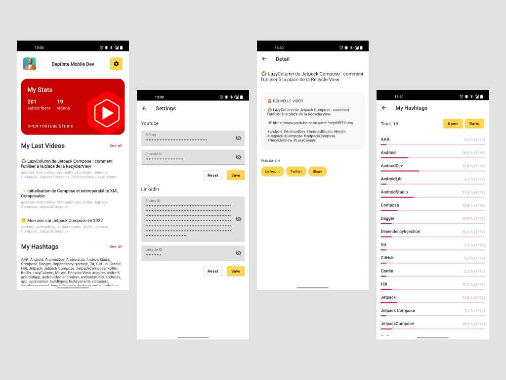
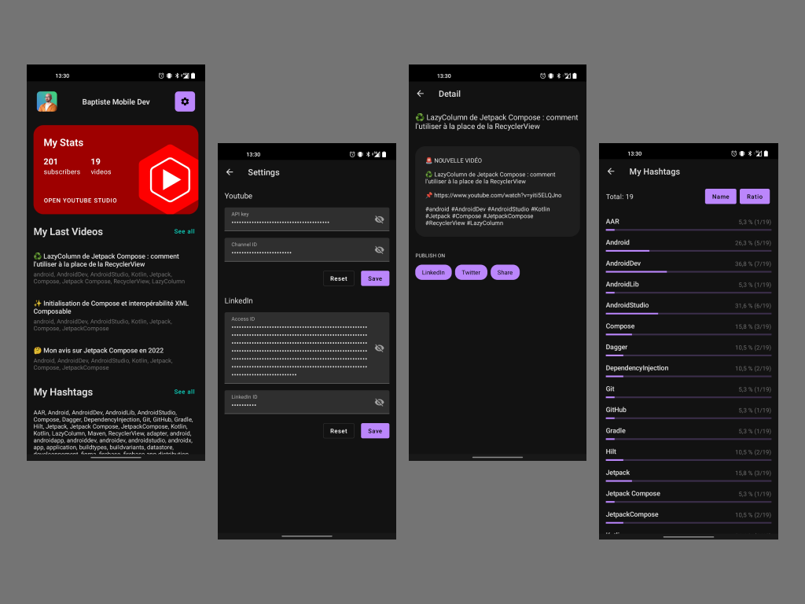

# Echo

Android app helping post to Twitter and LinkedIn.

## Requirements

To retrieve YouTube data :
 * YouTube API Key
 * YouTube Channel ID

In order to LinkedIn sharing to work :
 * LinkedIn app Access ID
 * LinkedIn user ID

## Stats

It also give few public stats about the youtube channel and the tags

## Screenshots

